# Sistema de Gestión de Voluntarios

Este proyecto es una aplicación backend desarrollada con NestJS para gestionar asignaciones de voluntarios. Permite crear, gestionar y asignar voluntarios a diferentes tareas.

## Características principales

- Gestión de asignaciones de voluntarios
- CRUD completo para asignaciones
- Validación de datos
- API RESTful con TypeScript
- Documentación automática con Swagger

## Requisitos previos

- Node.js (versión 16 o superior)
- npm (gestor de paquetes de Node.js)
- TypeScript

## Instalación

1. Clona el repositorio:
```bash
git clone https://github.com/OscarMeza24/Appserverweb.git
cd Practica1SegundoParcial/practica1
```

2. Instala las dependencias:
```bash
npm install
```

3. Ejecuta el proyecto en modo desarrollo:
```bash
npm run start:dev
```

## Uso

La aplicación estará disponible en `http://localhost:3000`.

### Rutas disponibles

# Nota: todas las rutas empiezan con /api/v1 
# (Profe pase alto una de la consideraciones antes de sacar todas las capturas y agrege a la setGlobalPrefix despues de haberlas sacado, igual todo esta igual de funcional esperando que esto no afecte la nota, le deseo un buen dia).

#### Módulo de Asignaciones
- `POST /asignaciones` - Crear una nueva asignación
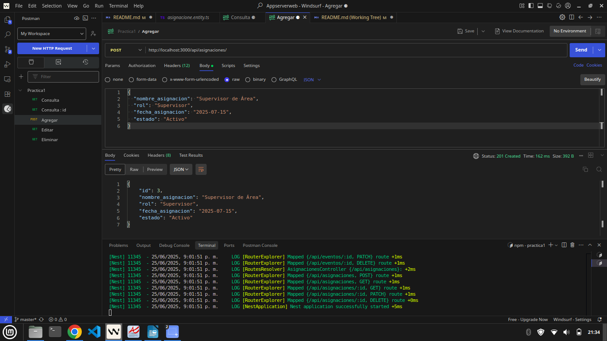
- `GET /asignaciones` - Obtener todas las asignaciones
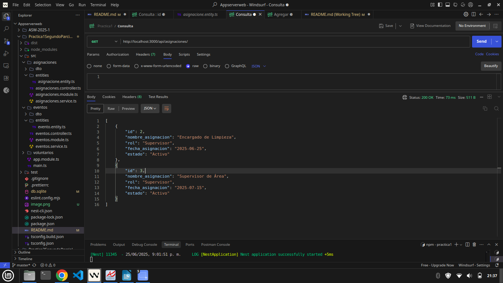
- `GET /asignaciones/:id` - Obtener una asignación específica
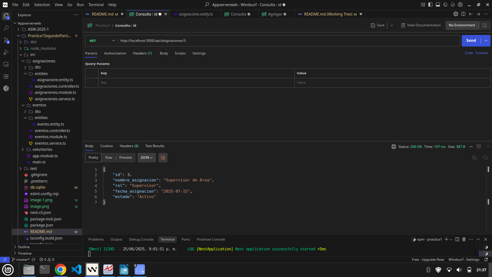
- `PATCH /asignaciones/:id` - Actualizar una asignación
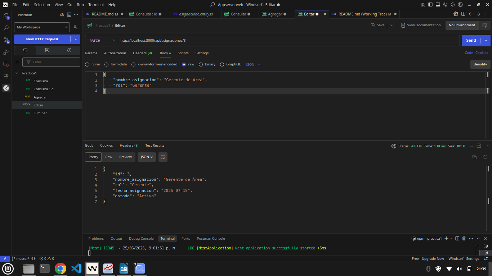
- `DELETE /asignaciones/:id` - Eliminar una asignación
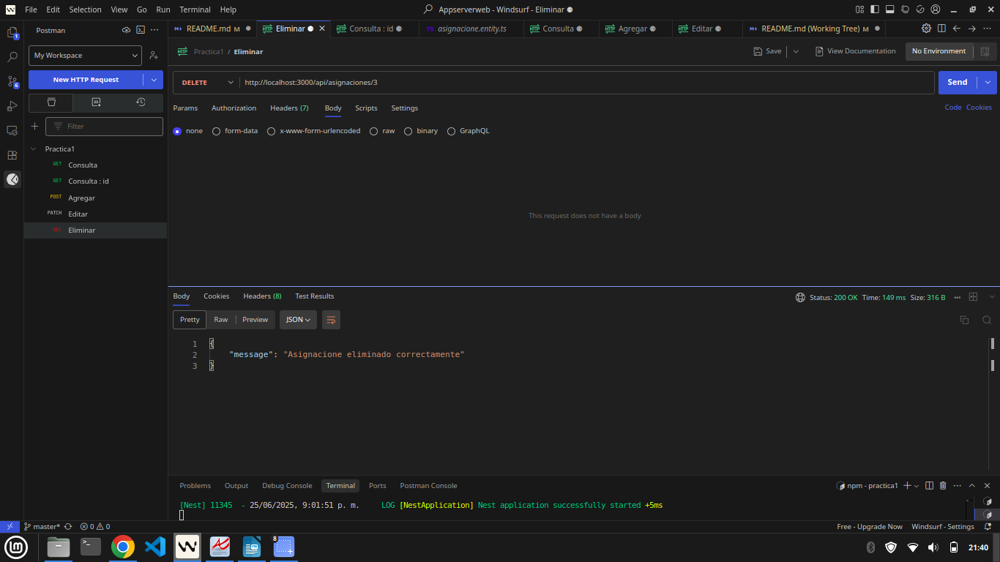

#### Módulo de Eventos
- `POST /eventos` - Crear un nuevo evento
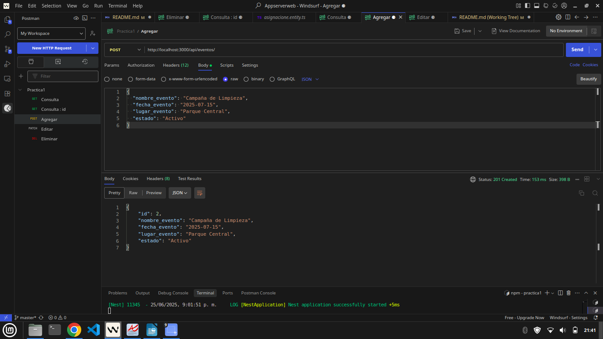
- `GET /eventos` - Obtener todos los eventos
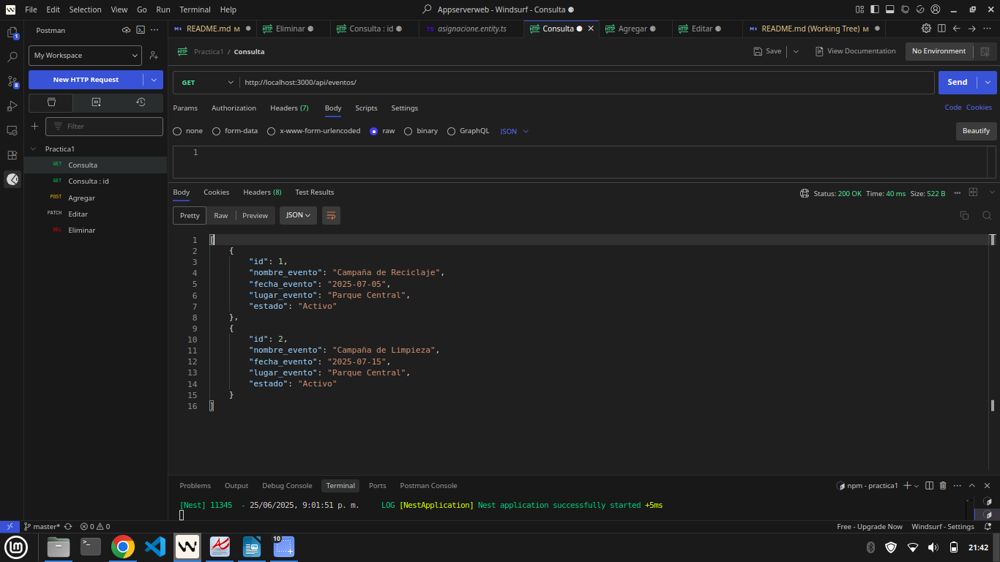
- `GET /eventos/:id` - Obtener un evento específico
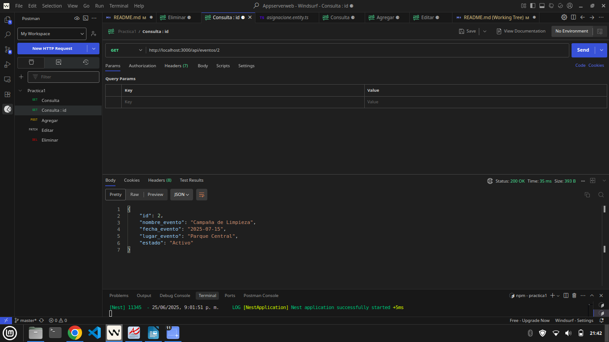
- `PATCH /eventos/:id` - Actualizar un evento
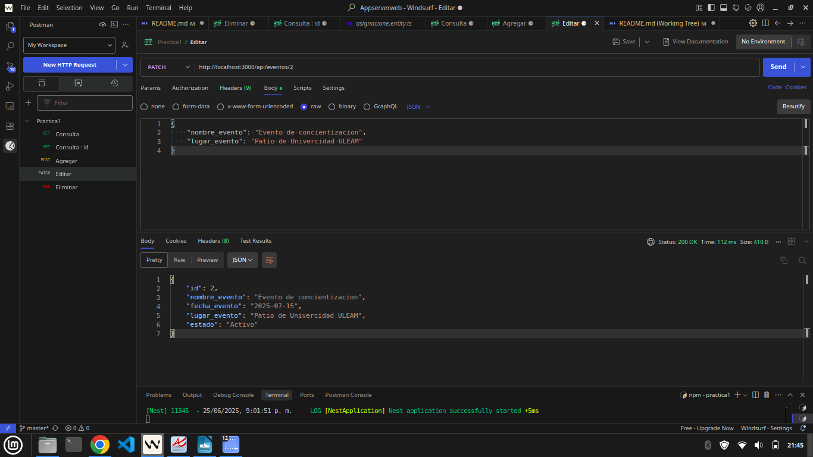
- `DELETE /eventos/:id` - Eliminar un evento
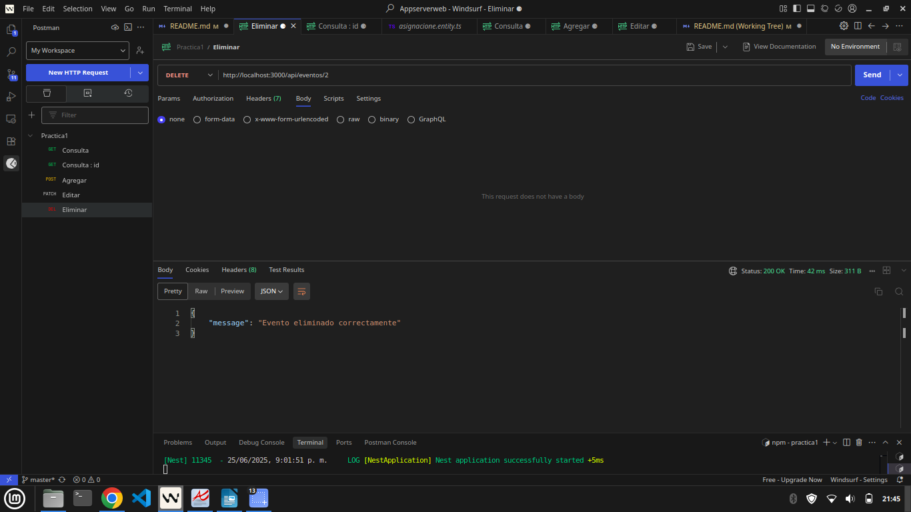

#### Módulo de Voluntarios
- `POST /voluntarios` - Crear un nuevo voluntario
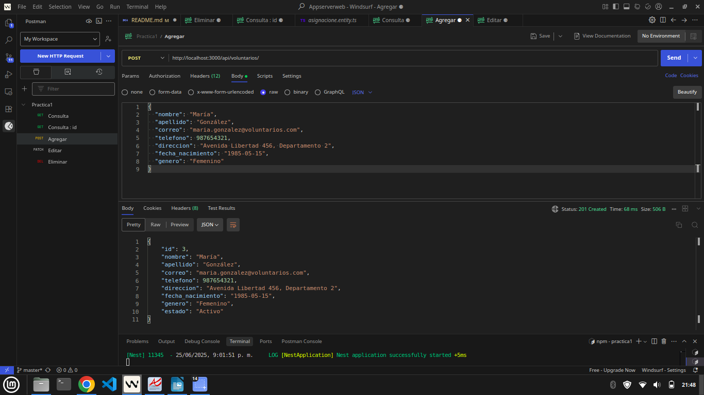
- `GET /voluntarios` - Obtener todos los voluntarios
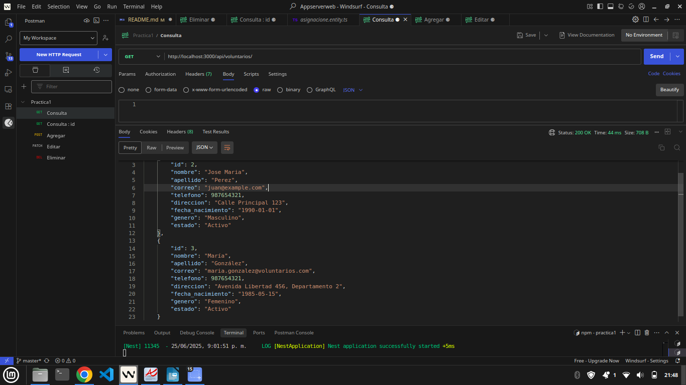
- `GET /voluntarios/:id` - Obtener un voluntario específico
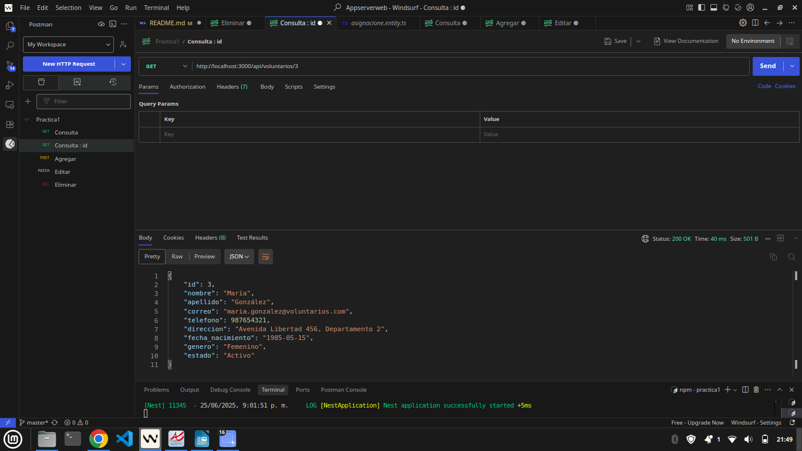
- `PATCH /voluntarios/:id` - Actualizar un voluntario
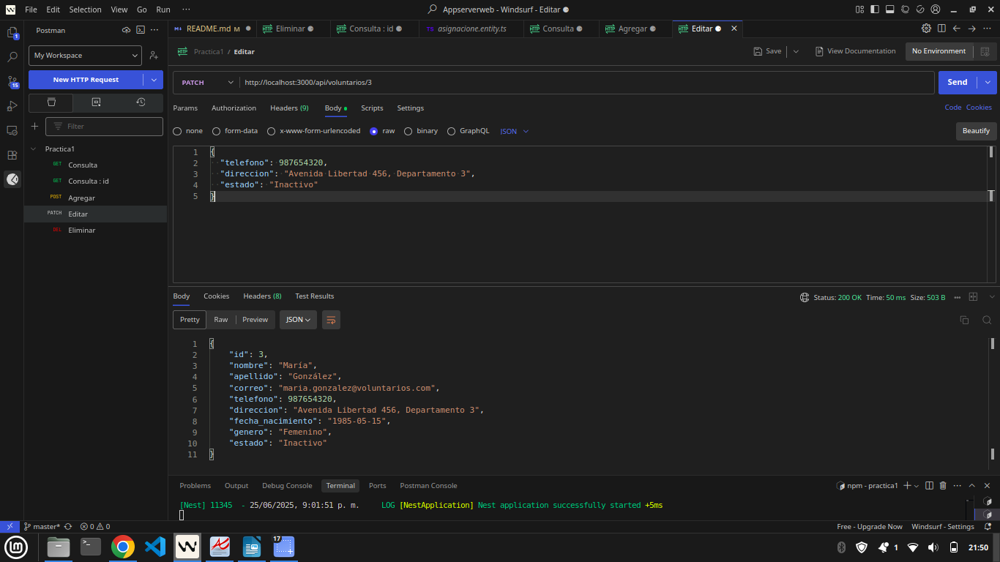
- `DELETE /voluntarios/:id` - Eliminar un voluntario
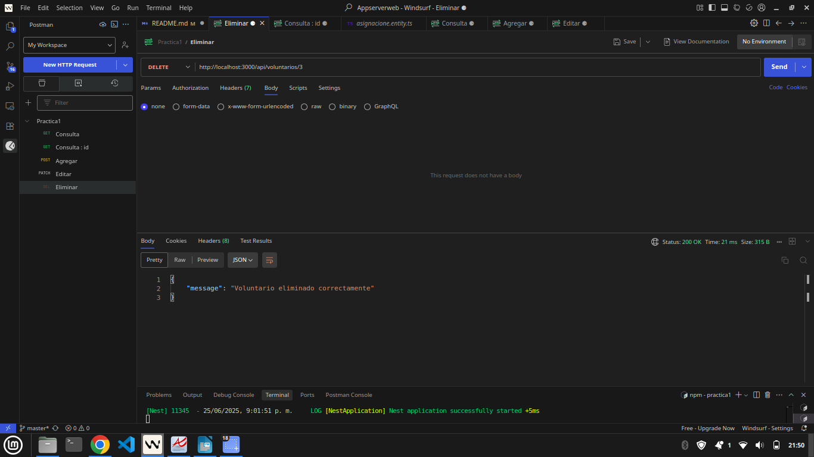

## Estructura del proyecto

- `/src/asignaciones`: Módulo principal con entidades, servicios y controladores
- `/src/asignaciones/entities`: Definición de las entidades
- `/src/asignaciones/dto`: Transferencia de objetos de datos
- `/src/asignaciones/services`: Lógica de negocio
- `/src/asignaciones/controllers`: Controladores HTTP

## Tecnologías utilizadas

- NestJS
- TypeScript
- Express
- Swagger/OpenAPI
- Node.js

## Pruebas

Para ejecutar las pruebas:
```bash
npm run test
```

## Modos de ejecución

- Desarrollo (con hot-reload):
```bash
npm run start:dev
```

- Producción:
```bash
npm run start:prod
```

## Run tests

```bash
# unit tests
$ npm run test

# e2e tests
$ npm run test:e2e

# test coverage
$ npm run test:cov
```

## Deployment

When you're ready to deploy your NestJS application to production, there are some key steps you can take to ensure it runs as efficiently as possible. Check out the [deployment documentation](https://docs.nestjs.com/deployment) for more information.

If you are looking for a cloud-based platform to deploy your NestJS application, check out [Mau](https://mau.nestjs.com), our official platform for deploying NestJS applications on AWS. Mau makes deployment straightforward and fast, requiring just a few simple steps:

```bash
$ npm install -g @nestjs/mau
$ mau deploy
```

With Mau, you can deploy your application in just a few clicks, allowing you to focus on building features rather than managing infrastructure.

## Resources

Check out a few resources that may come in handy when working with NestJS:

- Visit the [NestJS Documentation](https://docs.nestjs.com) to learn more about the framework.
- For questions and support, please visit our [Discord channel](https://discord.gg/G7Qnnhy).
- To dive deeper and get more hands-on experience, check out our official video [courses](https://courses.nestjs.com/).
- Deploy your application to AWS with the help of [NestJS Mau](https://mau.nestjs.com) in just a few clicks.
- Visualize your application graph and interact with the NestJS application in real-time using [NestJS Devtools](https://devtools.nestjs.com).
- Need help with your project (part-time to full-time)? Check out our official [enterprise support](https://enterprise.nestjs.com).
- To stay in the loop and get updates, follow us on [X](https://x.com/nestframework) and [LinkedIn](https://linkedin.com/company/nestjs).
- Looking for a job, or have a job to offer? Check out our official [Jobs board](https://jobs.nestjs.com).

## Support

Nest is an MIT-licensed open source project. It can grow thanks to the sponsors and support by the amazing backers. If you'd like to join them, please [read more here](https://docs.nestjs.com/support).

## Stay in touch

- Author - [Kamil Myśliwiec](https://twitter.com/kammysliwiec)
- Website - [https://nestjs.com](https://nestjs.com/)
- Twitter - [@nestframework](https://twitter.com/nestframework)

## License

Nest is [MIT licensed](https://github.com/nestjs/nest/blob/master/LICENSE).
